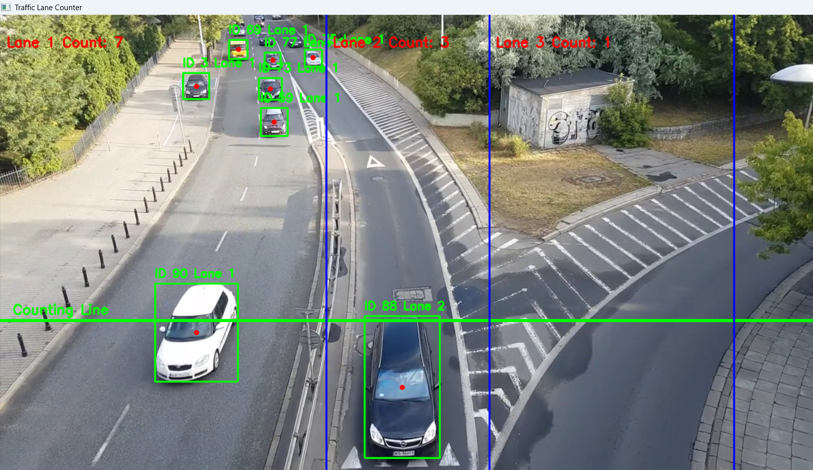

# 🚗 Traffic Flow Analysis — Vehicle Counting per Lane

## 📌 Objective
Develop a Python script to **analyze traffic flow** by counting vehicles in **three distinct lanes** using **computer vision**.  
The script detects, tracks, and counts vehicles in each lane separately, ensuring accurate counts without duplication.

---

## 🎯 Features
- **Vehicle Detection** — Uses a pre-trained YOLOv5 COCO model to detect cars, trucks, buses, and motorcycles.
- **Lane Definition & Counting** — Customizable lane boundaries for 3 lanes with separate counters.
- **Vehicle Tracking** — Uses SORT tracking algorithm to maintain unique IDs across frames.
- **Real-time Processing** — Optimized for smooth performance on standard hardware.
- **Automatic CSV Export** — Saves vehicle ID, lane number, and timestamp when crossing the counting line.

---

## 📂 Dataset
- **Input Video**: Traffic video from YouTube — [Watch here](https://www.youtube.com/watch?v=MNn9qKG2UFI)  
- The script processes a local copy of the video (rename to `traffic.mp4`).

---

## 🛠 Requirements

Install dependencies:
```bash
pip install opencv-python numpy torch pandas
pip install filterpy  # required for SORT tracker


## Download the SORT tracker Python file:
wget https://raw.githubusercontent.com/abewley/sort/master/sort.py


## Usage
Download the traffic video from the YouTube link and save as traffic.mp4 in the project folder.
Run the script:
python main.py

## ⚙️ Customization

Lane Boundaries — Edit these values in the script to match your video:

lane_boundaries = [
    int(frame_width*0.40),  # Lane 1-2 boundary
    int(frame_width*0.60),  # Lane 2-3 boundary
    int(frame_width*0.90)   # Lane 3 end
]


Counting Line Position — Change the green_line_y value to adjust the counting line height.

Vehicle Classes — Modify vehicle_classes to track different objects (COCO IDs: 2=car, 3=motorbike, 5=bus, 7=truck).


## Output
  
